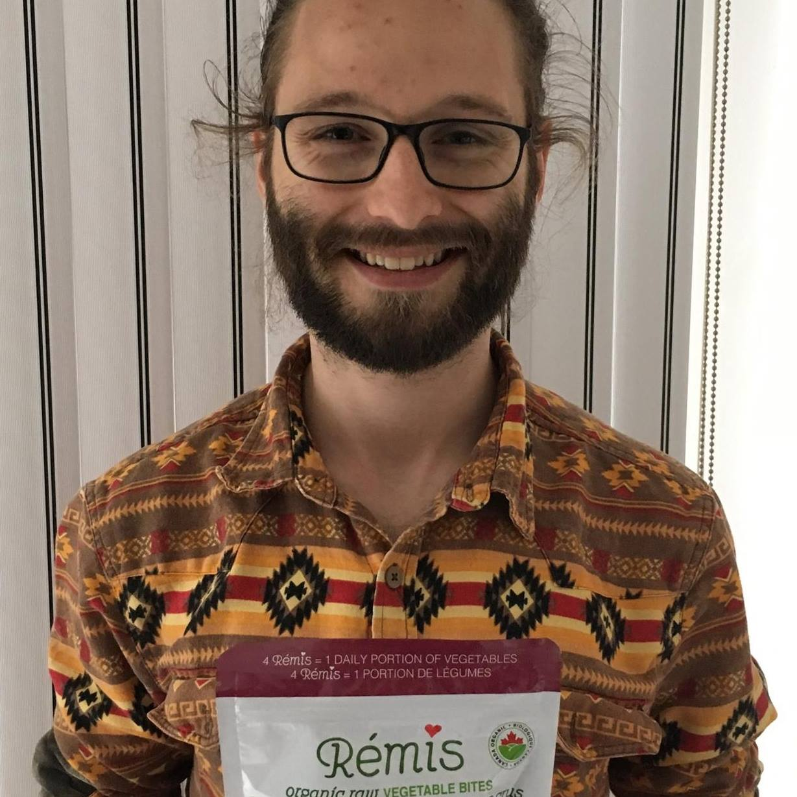

---
title: "How to Customize This Hugo/Wowchemy Site (Step by Step)"
summary: "Customize navigation, profile, styles, and publish updates safely with this step-by-step guide."
tags:
- Tutorial
- Hugo
- Wowchemy
- Website
date: "2026-02-08T00:00:00Z"

external_link: ""

image:
  caption: ""
  focal_point: ""

url_code: ""
url_pdf: "/files/hugo-wowchemy-customization-tutorial.pdf"
url_slides: ""
url_video: ""

slides: ""
---



## Overview

This tutorial shows how to customize this site in the correct files and publish changes without breaking your setup.[^hugo-config][^wowchemy-docs]

Download the PDF version here:

[Download the full tutorial (PDF)](/files/hugo-wowchemy-customization-tutorial.pdf)

## What You Will Customize

- Global site identity (`config/_default/config.toml`, `params.toml`)[^hugo-config]
- Navbar items and order (`config/_default/menus.toml`)[^hugo-menus]
- About/profile content (`content/home/bio.md`, `content/authors/.../_index.md`)[^wowchemy-customize]
- Visual style overrides (`assets/scss/custom.scss`)[^wowchemy-customize]
- Optional behavior tweaks (`layouts/partials/custom_js.html`)[^wowchemy-customize]

## Step-by-Step Summary

1. Update title/theme/menu config.[^hugo-config]
2. Align bio widget author with your author folder.[^wowchemy-customize]
3. Edit profile text, social links, and education.[^wowchemy-customize]
4. Tune styles in `custom.scss` only.[^wowchemy-customize]
5. Add post content and `featured.jpg`.
6. Build locally with `hugo` and verify.[^hugo-config]
7. Publish by pushing to your deployment branch.

![alt][content\project-blog\nature-reality\featured.jpg]

## Footnotes

[^hugo-config]: [Hugo Configuration](https://gohugo.io/getting-started/configuration/)
[^hugo-menus]: [Hugo Menus](https://gohugo.io/content-management/menus/)
[^wowchemy-docs]: [Wowchemy Docs](https://wowchemy.com/docs/)
[^wowchemy-customize]: [Wowchemy Customization](https://wowchemy.com/docs/getting-started/customize/)

## Additional Reference Image

