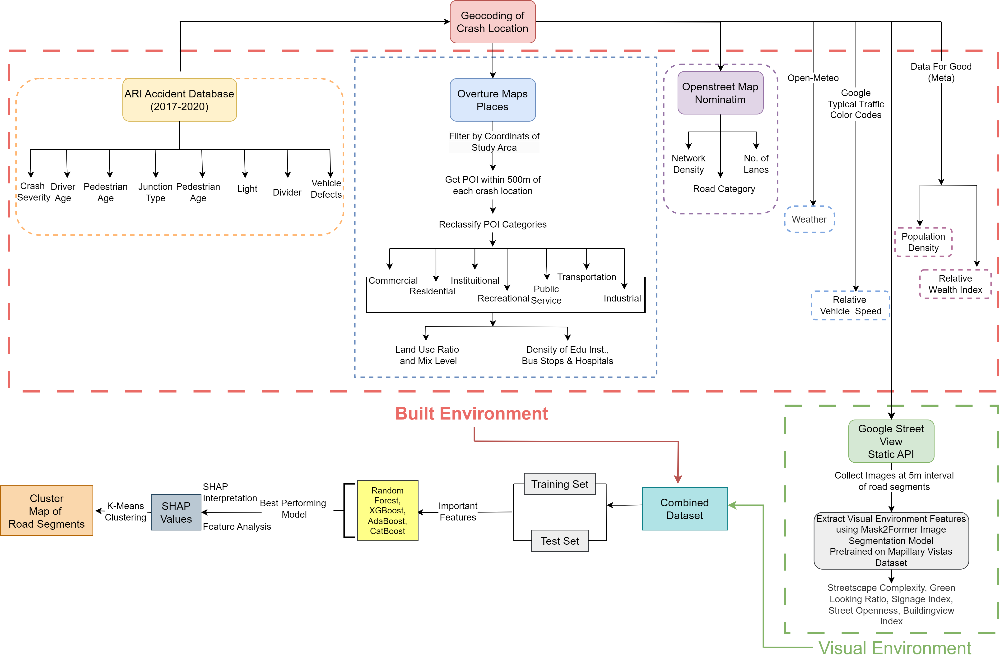

In this project, I demonstrate how publicly available geospatial data and Google Streetview Images can be utilized to determine the correleation between fatal crashes and driver’s visual and built environment for data-scarce regions. 

I designed a pipeline that collects Point-of-Interest data from Overture Maps, collects information about road and traffic from Google Traffic Color Codes, weather data from Open-Meteo API and then perform Semantic Segmentation to identify Streetscape Complexity, Street Openness, Building View Index, Greenview Index. Then train four ensemble models (XGBoost, AdaBoost, Random Forest, CatBoost) to predict crash severity. Finally perform SHAP interpretability to map how individual road segments contrbute to fatal road crashes.

